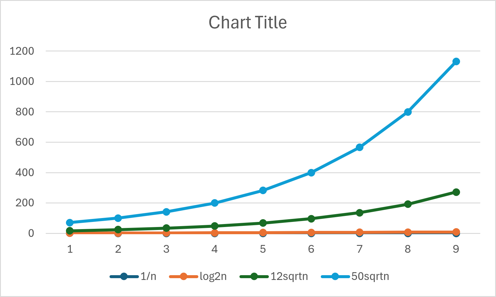
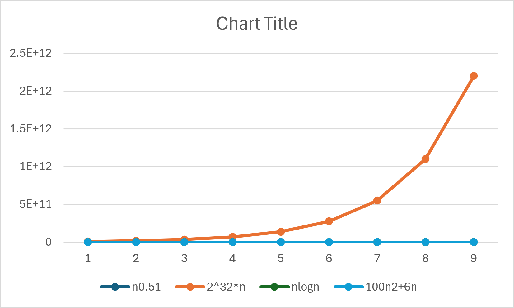
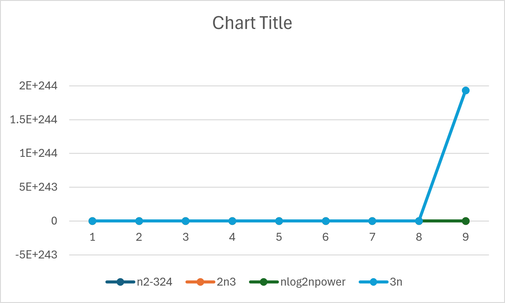

# DAA Lab
## Week 1 - Question 1
### Analysis of Growth Functions

### Name
**David Chauhan**

### College
**IIIT Bhubaneswar**

---

## Objective

The objective of **Week 1 - Question 1** is to analyze and compare the growth rates of different mathematical functions commonly used in the analysis of algorithms. The program computes the values of various functions for input sizes ranging from **2 to 1024**, stores the results in a CSV file, and visualizes the data using graphs.

---

## Functions Compared

The following functions are evaluated:

- 1/n
- log₂(log₂n)
- 12√n
- 50√n
- n^0.51
- 2³² × n
- n log₂n
- 100n² + 6n
- n² − 324
- 2n³
- n^(log₂n)
- 3ⁿ

---

## Algorithm

1. Create a CSV file named `growth.csv`.
2. Write the column headers.
3. Initialize `n = 2`.
4. Repeat until `n ≤ 1024`:
   - Calculate all the given growth functions.
   - Store the computed values in the CSV file.
   - Double the value of `n`.
5. Close the CSV file.
6. Import the CSV file into Microsoft Excel.
7. Generate graphs for comparison.

---

## Source Code

The program is implemented in **C** using the following libraries:

- `stdio.h`
- `math.h`

### Compilation

```bash
gcc growth.c -o growth -lm
```

### Execution

```bash
./growth
```

---

## Output

The program generates:

```
growth.csv
```

which contains the computed values of all growth functions for different input sizes.

---

# Graphs

## Graph 1
**Comparison of:**

- 1/n
- log₂(log₂n)
- 12√n
- 50√n



---

## Graph 2
**Comparison of:**

- n^0.51
- 2³² × n
- n log₂n
- 100n² + 6n



---

## Graph 3
**Comparison of:**

- n² − 324
- 2n³
- n^(log₂n)
- 3ⁿ



---

## Observations

- **1/n** decreases as the input size increases.
- **log₂(log₂n)** grows very slowly.
- **12√n** and **50√n** show moderate growth.
- **n^0.51** grows slightly faster than √n.
- **2³² × n** is linear with a very large constant multiplier.
- **n log₂n** grows faster than linear but slower than quadratic.
- **100n² + 6n** shows quadratic growth.
- **2n³** grows cubically.
- **n^(log₂n)** is a super-polynomial function.
- **3ⁿ** grows exponentially and dominates all other functions for large values of `n`.

---

## Conclusion

This experiment compares the growth behavior of different mathematical functions used in algorithm analysis. It demonstrates that algorithms with logarithmic, linear, and linearithmic complexities scale much better than polynomial and exponential algorithms. Such comparisons help in understanding algorithm efficiency for large input sizes.

---

## Tools Used

- C Programming Language
- GCC Compiler
- Microsoft Excel (for graph plotting)

---
**Course:** Design and Analysis of Algorithms (DAA)  
**Lab:** Week 1 - Question 1
