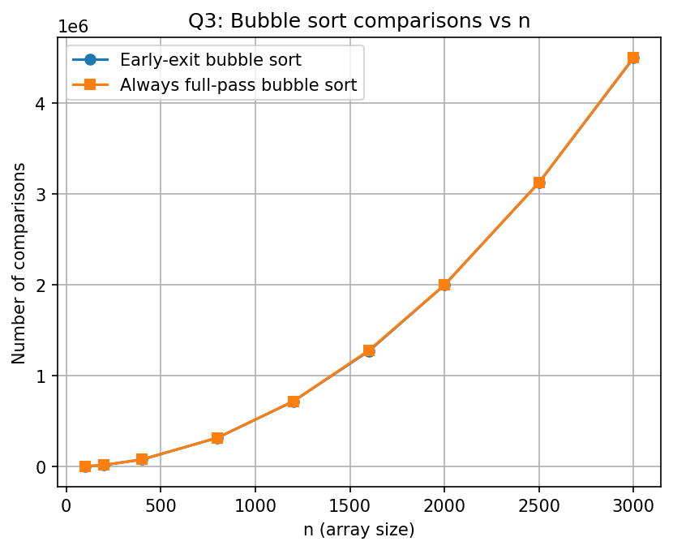

# DAA Lab
## Week 1 - Question 3
### Comparison of Bubble Sort Variants

### Name
**David Chauhan**

### College
**IIIT Bhubaneswar**

---

## Objective

The objective of this experiment is to compare two implementations of the Bubble Sort algorithm:

1. **Early-exit Bubble Sort**
2. **Always Full-pass Bubble Sort**

The comparison is based on the **number of comparisons** performed while sorting randomly generated arrays of different sizes.

---

## Problem Statement

Implement two versions of Bubble Sort:

- **Early-exit Bubble Sort**
  - Stops sorting if no swaps occur during a pass.
  - Best-case Time Complexity: **O(n)**

- **Always Full-pass Bubble Sort**
  - Executes all passes regardless of whether the array becomes sorted.
  - Best-case Time Complexity: **O(n²)**

Measure and compare the number of comparisons for various input sizes.

---

## Algorithm

### Early-exit Bubble Sort

1. Generate a random array.
2. Compare adjacent elements.
3. Swap them if they are in the wrong order.
4. Keep track of whether any swap occurred.
5. If no swaps occur during a pass, terminate the algorithm.
6. Count the total number of comparisons.

### Full-pass Bubble Sort

1. Generate the same random array.
2. Perform all Bubble Sort passes.
3. Compare adjacent elements.
4. Swap when required.
5. Continue until all passes are completed.
6. Count the total number of comparisons.

---

## Source Code

The program is implemented in **C** using the following libraries:

- `stdio.h`
- `stdlib.h`
- `time.h`

### Compilation

```bash
gcc bubble_sort.c -o bubble_sort
```

### Execution

```bash
./bubble_sort
```

---

## Output

The program generates the following CSV file:

```
bubble_results.csv
```

Sample Output

| n | Early-exit Comparisons | Full-pass Comparisons |
|---:|----------------------:|----------------------:|
|100|4940|4950|
|200|19234|19900|
|400|79745|79800|
|800|318820|319600|
|1200|718805|719400|
|1600|1271574|1279200|
|2000|1997170|1999000|
|2500|3123740|3123750|
|3000|4493144|4498500|

---

# Graph

## Bubble Sort Comparisons vs Array Size



---

## Observations

- Both Bubble Sort implementations require approximately **n(n−1)/2** comparisons for random input.
- The early-exit optimization provides only a small improvement on randomly generated arrays.
- As the array size increases, the number of comparisons grows rapidly.
- The graph shows that both curves almost overlap because random arrays rarely become sorted before all passes are completed.
- The early-exit version becomes significantly faster only when the input array is already sorted or nearly sorted.

---

## Time Complexity

| Algorithm | Best Case | Average Case | Worst Case |
|-----------|-----------|--------------|------------|
| Early-exit Bubble Sort | **O(n)** | **O(n²)** | **O(n²)** |
| Full-pass Bubble Sort | **O(n²)** | **O(n²)** | **O(n²)** |

---

## Conclusion

This experiment demonstrates that both Bubble Sort variants perform nearly the same number of comparisons on randomly generated arrays. The early-exit optimization has little effect on random data because swaps continue to occur throughout most of the sorting process.

However, when the input is already sorted or nearly sorted, the early-exit version terminates after the first pass, reducing the time complexity to **O(n)**. Therefore, the early-exit optimization is beneficial for nearly sorted datasets but provides limited improvement for random inputs.

---

## Tools Used

- C Programming Language
- GCC Compiler
- Microsoft Excel / Python (for graph plotting)

---

**Course:** Design and Analysis of Algorithms (DAA)

**Lab:** Week 1 - Question 3
