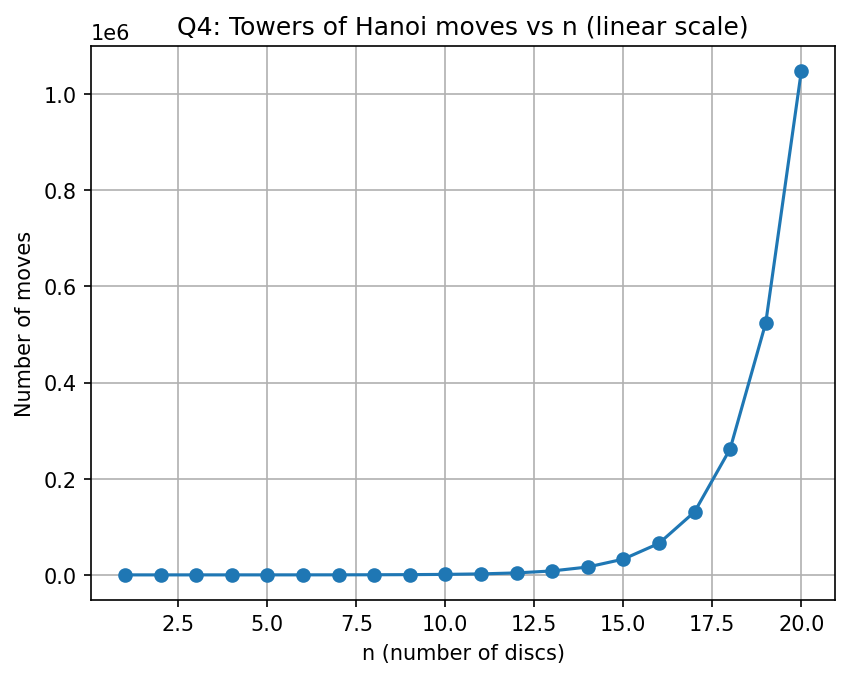
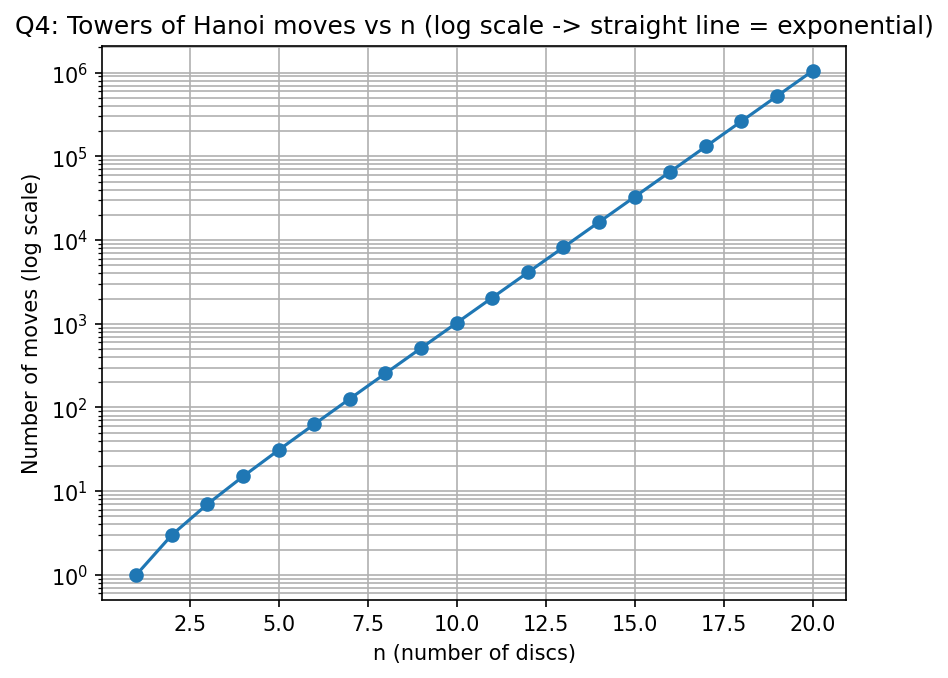

# DAA Lab
## Week 1 - Question 4
### Towers of Hanoi – Analysis of Number of Moves

### Name
**David Chauhan**

### College
**IIIT Bhubaneswar**

---

## Objective

The objective of this experiment is to implement the **Tower of Hanoi** algorithm using recursion, verify the recurrence relation, and analyze the growth of the number of moves required as the number of discs increases.

---

## Problem Statement

Implement the recursive Tower of Hanoi algorithm and determine the number of moves required to solve the puzzle for different values of **n**.

The recurrence relation is:

```
T(n) = 2T(n-1) + 1
```

with the base case:

```
T(0) = 0
```

The theoretical solution is:

```
T(n) = 2ⁿ − 1
```

Compare the actual number of moves with the theoretical value and visualize the growth using graphs.

---

## Algorithm

1. If there are no discs (`n = 0`), return.
2. Move the top `n−1` discs from the source rod to the auxiliary rod.
3. Move the largest disc from the source rod to the destination rod.
4. Move the `n−1` discs from the auxiliary rod to the destination rod.
5. Count every move performed.
6. Repeat the experiment for values of **n = 1 to 20**.
7. Store the results in a CSV file.
8. Plot the number of moves against the number of discs.

---

## Source Code

The program is implemented in **C** using the following libraries:

- `stdio.h`
- `stdlib.h`

### Compilation

```bash
gcc hanoi.c -o hanoi
```

### Execution

```bash
./hanoi
```

---

## Output

The program generates the following CSV file:

```
hanoi_results.csv
```

Sample Output

| n | Actual Moves | Expected (2ⁿ − 1) |
|--:|-------------:|------------------:|
|1|1|1|
|2|3|3|
|3|7|7|
|4|15|15|
|5|31|31|
|6|63|63|
|7|127|127|
|8|255|255|
|9|511|511|
|10|1023|1023|
|11|2047|2047|
|12|4095|4095|
|13|8191|8191|
|14|16383|16383|
|15|32767|32767|
|16|65535|65535|
|17|131071|131071|
|18|262143|262143|
|19|524287|524287|
|20|1048575|1048575|

---

# Graphs

## Graph 1: Towers of Hanoi (Linear Scale)



---

## Graph 2: Towers of Hanoi (Logarithmic Scale)



---

## Observations

- The actual number of moves exactly matches the theoretical value **2ⁿ − 1** for every value of **n**.
- The linear-scale graph shows that the number of moves increases very rapidly as the number of discs increases.
- The logarithmic-scale graph appears almost as a straight line, indicating exponential growth.
- Even a small increase in the number of discs significantly increases the number of required moves.
- For **20 discs**, more than **one million moves** are required.

---

## Time Complexity

| Case | Complexity |
|------|------------|
| Best Case | **O(2ⁿ)** |
| Average Case | **O(2ⁿ)** |
| Worst Case | **O(2ⁿ)** |

The recursive relation is:

```
T(n) = 2T(n−1) + 1
```

which solves to:

```
T(n) = 2ⁿ − 1
```

Therefore, the Tower of Hanoi algorithm has **exponential time complexity**.

---

## Conclusion

The experiment verifies that the recursive Tower of Hanoi algorithm follows the recurrence relation:

```
T(n) = 2T(n−1) + 1
```

and requires exactly **2ⁿ − 1** moves to solve the puzzle.

The graphs clearly illustrate the exponential growth of the algorithm. While the recursive approach is elegant and mathematically correct, the number of required moves increases rapidly, making the algorithm impractical for large values of **n**.

---

## Tools Used

- C Programming Language
- GCC Compiler
- Microsoft Excel / Python (for graph plotting)

---

**Course:** Design and Analysis of Algorithms (DAA)

**Lab:** Week 1 - Question 4
