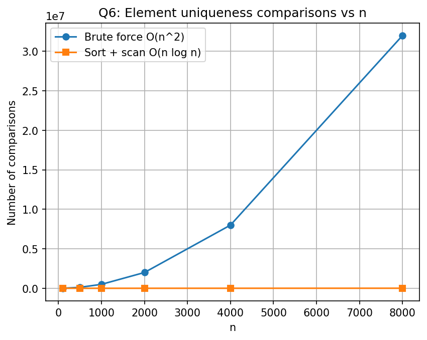

# DAA Lab
## Week 1 - Question 6
### Element Uniqueness Problem – Brute Force vs Sort-Based Approach

### Name
**David Chauhan**

### College
**IIIT Bhubaneswar**

---

## Objective

The objective of this experiment is to compare two approaches for solving the **Element Uniqueness Problem**:

1. **Brute Force Method**
2. **Sort-Based Method**

The comparison is based on the number of comparisons and execution time for arrays of different sizes.

---

## Problem Statement

Given an array of integers, determine whether the array contains duplicate elements.

Implement and compare two algorithms:

- **Brute Force**
  - Compare every pair of elements.
  - Worst-case Time Complexity: **O(n²)**

- **Sort-Based Method**
  - Sort the array first.
  - Scan adjacent elements for duplicates.
  - Time Complexity: **O(n log n)**

The experiment uses arrays containing **unique elements** to analyze the worst-case performance.

---

## Algorithm

### Brute Force Method

1. Compare every element with all subsequent elements.
2. If two equal elements are found, stop and report a duplicate.
3. Otherwise, continue until all pairs have been checked.
4. Count the total number of comparisons.

### Sort-Based Method

1. Create a copy of the original array.
2. Sort the copied array using `qsort()`.
3. Compare adjacent elements.
4. If two consecutive elements are equal, report a duplicate.
5. Count the total number of comparisons.

---

## Source Code

The program is implemented in **C** using the following libraries:

- `stdio.h`
- `stdlib.h`
- `time.h`

### Compilation

```bash
gcc uniqueness.c -o uniqueness
```

### Execution

```bash
./uniqueness
```

---

## Output

The program generates the following CSV file:

```
uniqueness_results.csv
```

Sample Output

| n | Brute Comparisons | Brute Time (s) | Sort Comparisons | Sort Time (s) | Duplicate Found |
|---:|-----------------:|---------------:|-----------------:|--------------:|:---------------|
|100|4950|0.000004|99|0.000008|No|
|500|124750|0.000052|499|0.000036|No|
|1000|499500|0.000235|999|0.000077|No|
|2000|1999000|0.000741|1999|0.000186|No|
|4000|7998000|0.003012|3999|0.000357|No|
|8000|31996000|0.012057|7999|0.000776|No|

---

# Graph

## Element Uniqueness Comparisons vs Array Size



---

## Observations

- The brute-force algorithm performs approximately **n(n−1)/2** comparisons.
- The number of comparisons increases quadratically as the input size increases.
- The sort-based algorithm performs only about **n** comparisons after sorting.
- The execution time of the sort-based method remains much lower than the brute-force method.
- As the input size grows, the performance gap between the two methods becomes significantly larger.
- Since the test arrays contain only unique elements, the brute-force algorithm executes its worst-case scenario.

---

## Time Complexity

| Algorithm | Best Case | Average Case | Worst Case |
|-----------|-----------|--------------|------------|
| Brute Force | **O(n²)** | **O(n²)** | **O(n²)** |
| Sort + Scan | **O(n log n)** | **O(n log n)** | **O(n log n)** |

---

## Conclusion

This experiment demonstrates that the brute-force approach becomes inefficient as the array size increases because it compares every possible pair of elements.

The sort-based approach first sorts the array and then performs a single linear scan to detect duplicates. Although sorting introduces an **O(n log n)** cost, it is much more efficient than the quadratic brute-force approach for large datasets.

The experimental results and graph clearly show that the sort-based algorithm scales much better and is the preferred solution for large input sizes.

---

## Tools Used

- C Programming Language
- GCC Compiler
- `qsort()` Standard Library Function
- Microsoft Excel / Python (for graph plotting)

---

**Course:** Design and Analysis of Algorithms (DAA)

**Lab:** Week 1 - Question 6
