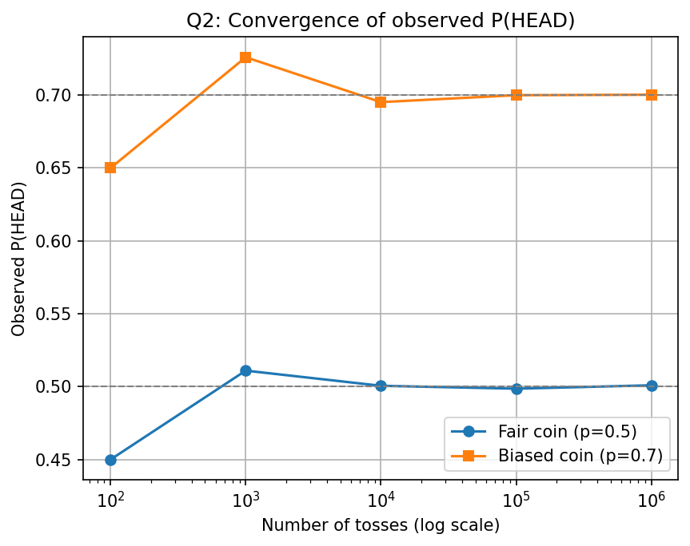

# DAA Lab
## Week 1 - Question 2
### Convergence of Observed Probability of Heads

### Name
**David Chauhan**

### College
**IIIT Bhubaneswar**

---

## Objective

The objective of this experiment is to simulate the tossing of a **fair coin** and a **biased coin**, estimate the probability of getting heads, and observe how the estimated probability converges to the theoretical probability as the number of tosses increases.

---

## Problem Statement

Simulate the following two experiments:

1. **Fair Coin**
   - Probability of Heads = **0.5**

2. **Biased Coin**
   - Probability of Heads = **0.7**

Perform the simulation for different numbers of tosses:

- 100
- 1,000
- 10,000
- 100,000
- 1,000,000

Compare the observed probabilities with the theoretical probabilities and visualize the convergence using a graph.

---

## Algorithm

1. Initialize the random number generator.
2. Define a function to simulate a single coin toss.
3. Generate a random number between 0 and 1.
4. If the random number is less than the given probability `p`, count it as **Head**.
5. Repeat the process for the specified number of tosses.
6. Calculate the observed probability:

   ```
   P(HEAD) = Number of Heads / Total Tosses
   ```

7. Repeat the experiment for both the fair and biased coins.
8. Store the results in a CSV file.
9. Plot the observed probabilities against the number of tosses.

---

## Source Code

The program is written in **C** using the following libraries:

- `stdio.h`
- `stdlib.h`
- `time.h`

### Compilation

```bash
gcc coin_simulation.c -o coin_simulation
```

### Execution

```bash
./coin_simulation
```

---

## Output

The program generates the following CSV file:

```
coin_results.csv
```

Sample Output:

| Tosses | Fair Coin | Biased Coin |
|--------:|----------:|------------:|
|100|0.45000|0.65000|
|1,000|0.51100|0.72600|
|10,000|0.50060|0.69520|
|100,000|0.49861|0.69994|
|1,000,000|0.50093|0.70028|

---

# Graph

## Convergence of Observed Probability of Heads



---

## Observations

- For a **fair coin**, the observed probability gradually approaches **0.5** as the number of tosses increases.
- For a **biased coin**, the observed probability approaches **0.7**.
- Small numbers of tosses show noticeable fluctuations due to randomness.
- Increasing the number of tosses reduces random variation and produces more accurate estimates.
- The simulation demonstrates the **Law of Large Numbers**, which states that the observed probability converges to the true probability as the number of trials increases.

---

## Conclusion

The experiment successfully demonstrates that increasing the number of coin tosses causes the observed probability of getting heads to converge to the theoretical probability.

- **Fair Coin:** Converges to **0.5**
- **Biased Coin:** Converges to **0.7**

This experiment illustrates the practical application of probability theory and the Law of Large Numbers using computer simulation.

---

## Tools Used

- C Programming Language
- GCC Compiler
- Microsoft Excel / Python (for graph plotting)

---

**Course:** Design and Analysis of Algorithms (DAA)

**Lab:** Week 1 - Question 2
