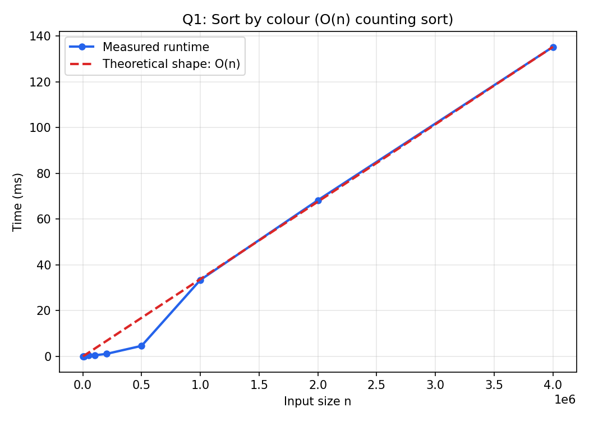
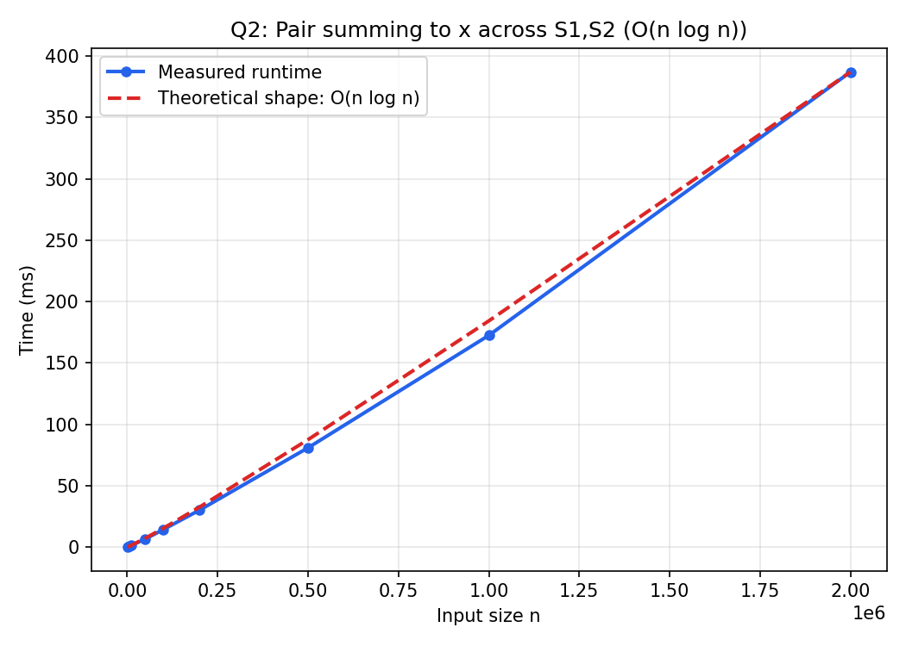
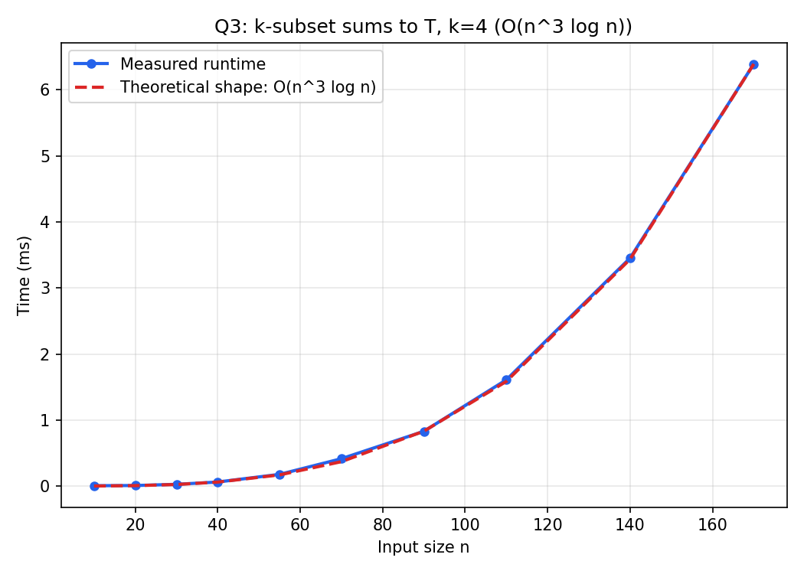
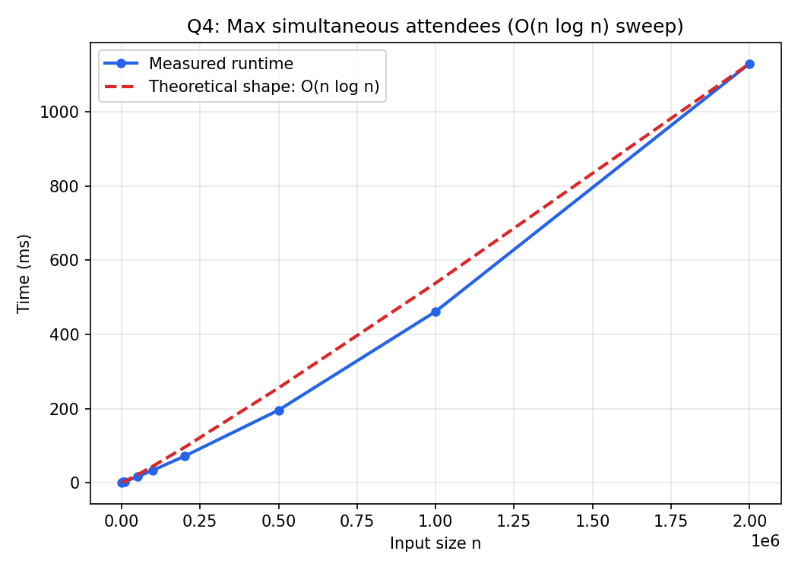
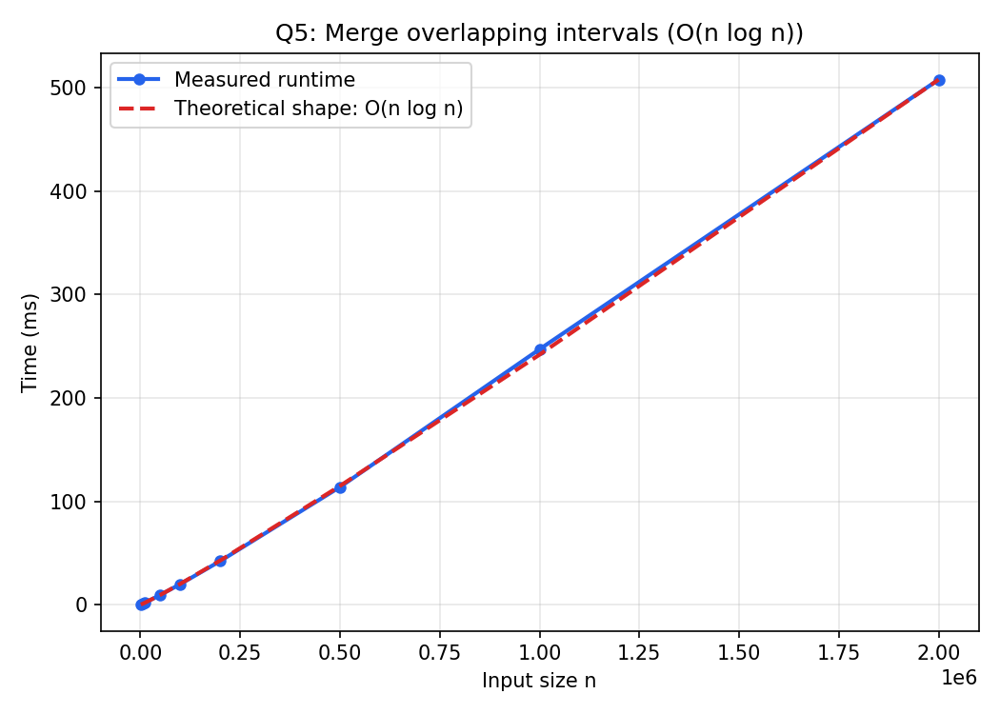
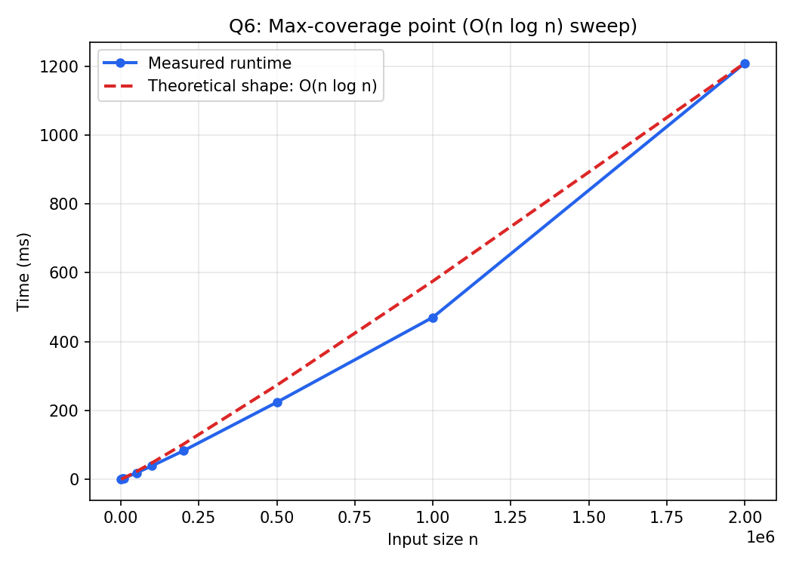

# Design and Analysis of Algorithms — Lab 04

C implementations and empirical timing studies for six sorting-based application problems, each solved by sorting (or an equivalent sweep) to bring the naive time complexity down.

## Contents

| Question | Topic | Source | Results |
| --- | --- | --- | --- |
| 1 | Sort (number, colour) pairs by colour in O(n) | [Application_of_sorting-I.c](1.Application_of_sorting-I/Application_of_sorting-I.c) | [CSV](1.Application_of_sorting-I/Application_of_sorting-I.csv) · [plot](1.Application_of_sorting-I/Application_of_sorting-I.png) |
| 2 | Pair summing to x, one element from each of two sets | [Application_of_sorting-II.c](2.Application_of_sorting-II/Application_of_sorting-II.c) | [CSV](2.Application_of_sorting-II/Application_of_sorting-II.csv) · [plot](2.Application_of_sorting-II/Application_of_sorting-II.png) |
| 3 | Does some k-subset of S sum to T? | [Application_of_sorting-III.c](3.Application_of_sorting-III/Application_of_sorting-III.c) | [CSV](3.Application_of_sorting-III/Application_of_sorting-III.csv) · [plot](3.Application_of_sorting-III/Application_of_sorting-III.png) |
| 4 | Time with the most people simultaneously present | [Application_of_sorting-IV.c](4.Application_of_sorting-IV/Application_of_sorting-IV.c) | [CSV](4.Application_of_sorting-IV/Application_of_sorting-IV.csv) · [plot](4.Application_of_sorting-IV/Application_of_sorting-IV.png) |
| 5 | Merge overlapping intervals | [Application_of_sorting-V.c](5.Application_of_sorting-V/Application_of_sorting-V.c) | [CSV](5.Application_of_sorting-V/Application_of_sorting-V.csv) · [plot](5.Application_of_sorting-V/Application_of_sorting-V.png) |
| 6 | Point covered by the largest number of intervals | [Application_of_sorting-VI.c](6.Application_of_sorting-VI/Application_of_sorting-VI.c) | [CSV](6.Application_of_sorting-VI/Application_of_sorting-VI.csv) · [plot](6.Application_of_sorting-VI/Application_of_sorting-VI.png) |

## Requirements and execution

A C compiler such as GCC or Clang is required. Run each program from its own directory so that its generated CSV is saved beside the source file. Each program offers three modes at runtime: (1) interactive input, (2) a built-in demo, and (3) a timing benchmark that writes the CSV used for the report plot.

```bash
# Question 1
cd 1.Application_of_sorting-I
cc -std=c11 -Wall -Wextra -O2 Application_of_sorting-I.c -o Application_of_sorting-I
./Application_of_sorting-I

# Question 2
cd ../2.Application_of_sorting-II
cc -std=c11 -Wall -Wextra -O2 Application_of_sorting-II.c -o Application_of_sorting-II
./Application_of_sorting-II

# Question 3
cd ../3.Application_of_sorting-III
cc -std=c11 -Wall -Wextra -O2 Application_of_sorting-III.c -o Application_of_sorting-III
./Application_of_sorting-III

# Question 4
cd ../4.Application_of_sorting-IV
cc -std=c11 -Wall -Wextra -O2 Application_of_sorting-IV.c -o Application_of_sorting-IV
./Application_of_sorting-IV

# Question 5
cd ../5.Application_of_sorting-V
cc -std=c11 -Wall -Wextra -O2 Application_of_sorting-V.c -o Application_of_sorting-V
./Application_of_sorting-V

# Question 6
cd ../6.Application_of_sorting-VI
cc -std=c11 -Wall -Wextra -O2 Application_of_sorting-VI.c -o Application_of_sorting-VI
./Application_of_sorting-VI
```

---

## 1. Sort (number, colour) pairs by colour in O(n)

Each item is a `(number, colour)` pair where colour is one of three values (Red/Blue/Yellow). Rather than using a comparison sort, the program applies a **counting-sort-style bucket approach**:

1. Count how many items fall into each of the 3 colour buckets.
2. Compute each bucket's starting offset as a prefix sum of the counts.
3. Scan the input once more, placing each item directly into its bucket's next free slot.

Since the number of colours is a small constant, this runs in

\[
T(n) = \Theta(n)
\]

with numbers staying in their original relative order within each colour (a stable partition), unlike a general \(\Theta(n \log n)\) comparison sort.



---

## 2. Pair summing to x, one element from each of two sets

Given two sets \(S_1, S_2\) of size \(n\) and a target \(x\), the goal is to decide whether some \(a \in S_1, b \in S_2\) satisfy \(a + b = x\):

1. Sort \(S_2\) — \(\Theta(n \log n)\).
2. For each \(a\) in \(S_1\), binary-search \(S_2\) for the complement \(x - a\) — \(\Theta(\log n)\) per lookup.

Total running time:

\[
T(n) = \Theta(n \log n) + n \cdot \Theta(\log n) = \Theta(n \log n)
\]

which beats the naive \(\Theta(n^2)\) all-pairs check.



---

## 3. Does some k-subset of S sum to T?

For a fixed \(k\), the program decides whether any \(k\) elements of \(S\) (size \(n\)) sum to a target \(T\):

1. Sort a copy of \(S\) — \(\Theta(n \log n)\).
2. Recursively enumerate all \(\binom{n}{k-1}\) choices of the first \(k - 1\) elements, and binary-search the sorted array for the value needed to complete the sum to \(T\).

This gives

\[
T(n) = \Theta(n \log n) + O(n^{k-1}) \cdot \Theta(\log n) = O(n^{k-1} \log n)
\]

for fixed \(k\), which is far better than brute-forcing all \(\binom{n}{k}\) subsets directly once \(k\) is held constant and \(n\) grows.



---

## 4. Time with the most people simultaneously present

Given \(n\) people's entry and exit times, the program finds the moment when the most people are present at once using a **sweep-line** technique:

1. Turn each person's interval into two events: `+1` at entry, `-1` at exit.
2. Sort all `2n` events by time — \(\Theta(n \log n)\).
3. Sweep through the sorted events once, maintaining a running count and tracking its maximum.

\[
T(n) = \Theta(n \log n) + \Theta(n) = \Theta(n \log n)
\]

instead of the naive \(\Theta(n^2)\) approach of checking, for every entry time, how many intervals are active.



---

## 5. Merge overlapping intervals

Given \(n\) intervals, the program merges all overlapping ones into a minimal set of disjoint intervals:

1. Sort the intervals by their left endpoint — \(\Theta(n \log n)\).
2. Sweep through them once, extending the current merged interval whenever the next one overlaps it, and starting a new one otherwise.

\[
T(n) = \Theta(n \log n) + \Theta(n) = \Theta(n \log n)
\]

which is the standard optimal result for interval merging, versus \(\Theta(n^2)\) for a naive pairwise overlap check.



---

## 6. Point covered by the largest number of intervals

Given \(n\) intervals \([l_i, r_i]\), the program finds a point covered by the most intervals, again via a **sweep line**:

1. Turn each interval into a `+1` event at \(l_i\) and a `-1` event at \(r_i\).
2. Sort the `2n` events by coordinate, breaking ties so that all `+1` events at a coordinate are processed before the `-1` events at the same coordinate (so intervals touching at an endpoint still count as overlapping there).
3. Sweep once, tracking the running coverage count and the coordinate where it peaks.

\[
T(n) = \Theta(n \log n) + \Theta(n) = \Theta(n \log n)
\]

versus the naive \(\Theta(n^2)\) method of testing every interval's endpoint against every other interval.



## Results

The experimental plots and CSV files support the expected trends:

- Colour-bucket sorting scales linearly, \(\Theta(n)\), noticeably outpacing a general-purpose comparison sort as \(n\) grows.
- The two-set pair-sum search, the k-subset sum search (for fixed \(k\)), interval merging, and both sweep-line problems all scale near \(n \log n\), consistent with a single dominant sort (or sort-equivalent) step followed by a linear or near-linear scan.
- All six approaches avoid the quadratic-or-worse blowup of their naive brute-force counterparts by sorting the data first and exploiting the resulting order.
