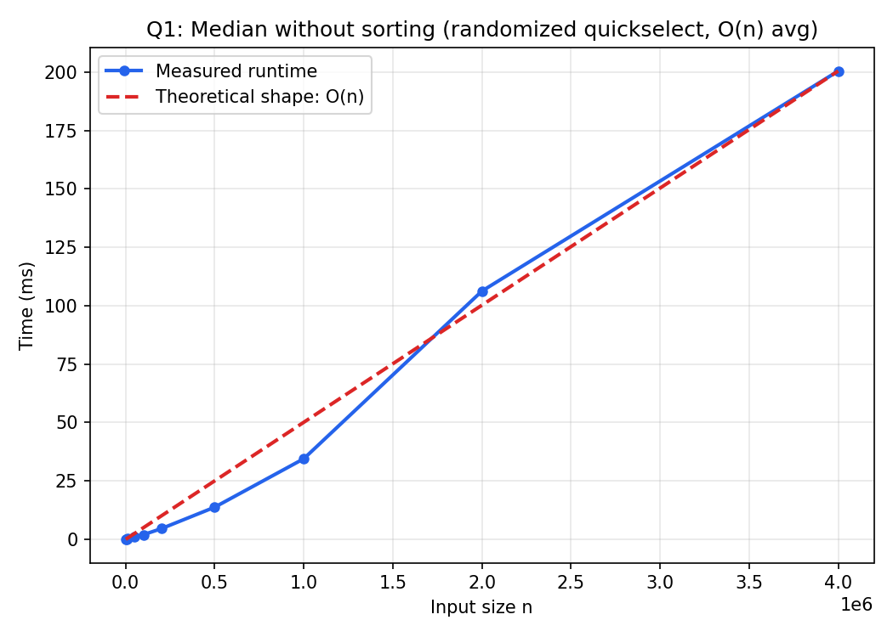
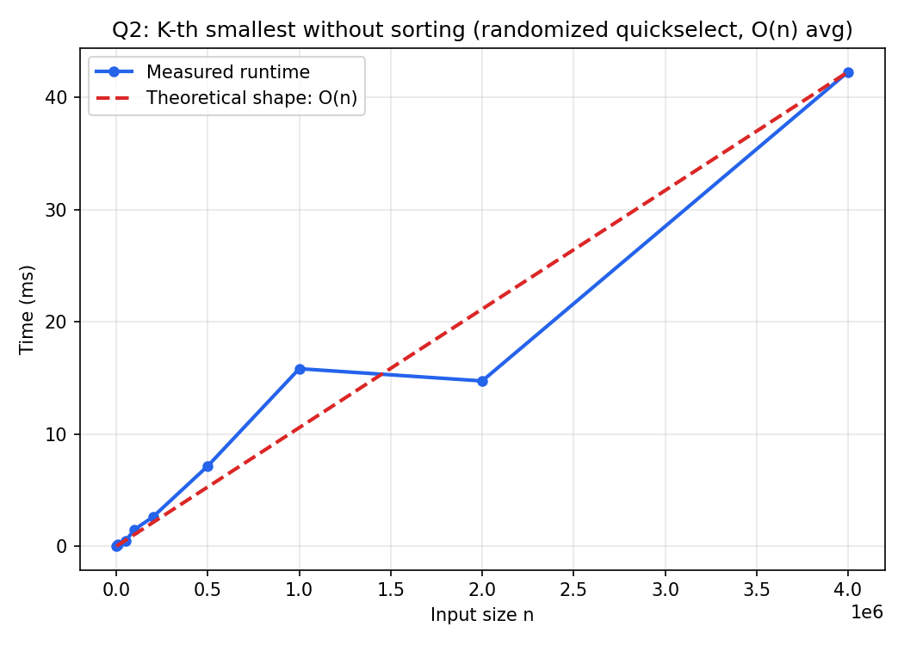
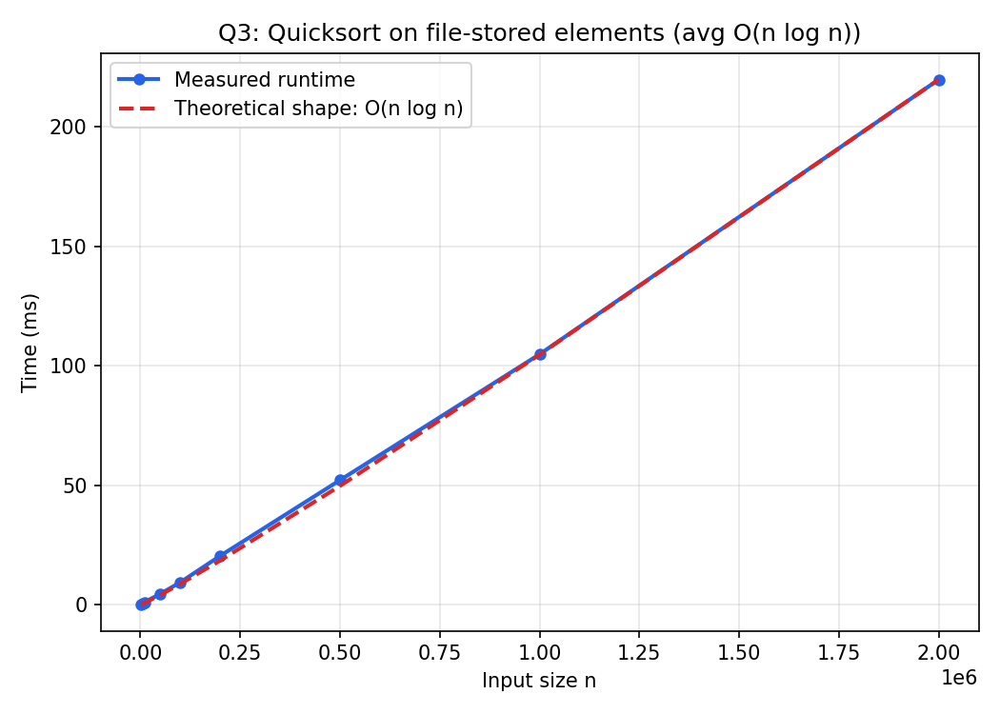
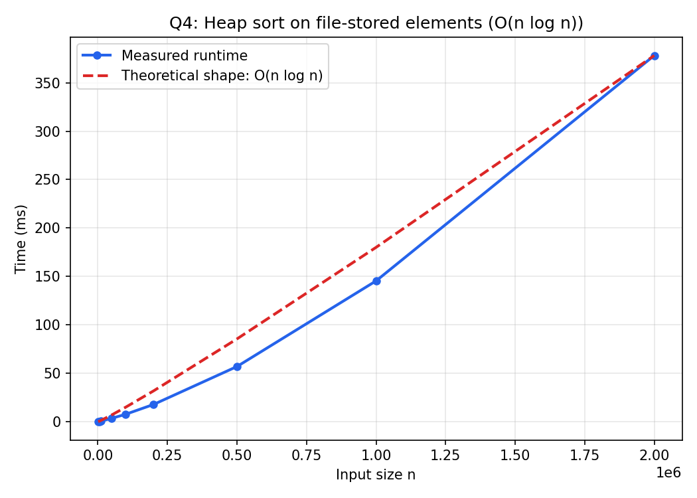

# Design and Analysis of Algorithms — Lab 05

C implementations and empirical timing studies for randomized selection (quickselect) and two classic O(n log n) comparison sorts applied to large file-based datasets.

## Contents

| Question | Topic | Source | Results |
| --- | --- | --- | --- |
| 1 | Median of N numbers without sorting | [Median_of_N_numbers_without_sorting.c](1.Median_of_N_numbers_without_sorting/Median_of_N_numbers_without_sorting.c) | [CSV](1.Median_of_N_numbers_without_sorting/1D_array_operations_and_their_complexities.csv) · [plot](1.Median_of_N_numbers_without_sorting/Median_of_N_numbers_without_sorting.png) |
| 2 | K-th smallest element without sorting | [K-th_smallest_element_without_sorting.c](2.K-th_smallest_element_without_sorting/K-th_smallest_element_without_sorting.c) | [CSV](2.K-th_smallest_element_without_sorting/K-th_smallest_element_without_sorting.csv) · [plot](2.K-th_smallest_element_without_sorting/K-th_smallest_element_without_sorting.png) |
| 3 | Quicksort of N random elements stored in a file | [Quicksort_of_N_random_elements_stored_in_a_file.c](3.Quicksort_of_N_random_elements_stored_in_a_file/Quicksort_of_N_random_elements_stored_in_a_file.c) | [CSV](3.Quicksort_of_N_random_elements_stored_in_a_file/Quicksort_of_N_random_elements_stored_in_a_file.csv) · [plot](3.Quicksort_of_N_random_elements_stored_in_a_file/Quicksort_of_N_random_elements_stored_in_a_file.png) |
| 4 | Heap sort of N randomly generated elements stored in a file | [Heap_sort_of_N_randomly_generated_elements_stored_in_a_file.c](4.Heap_sort_of_N_randomly_generated_elements_stored_in_a_file/Heap_sort_of_N_randomly_generated_elements_stored_in_a_file.c) | [CSV](4.Heap_sort_of_N_randomly_generated_elements_stored_in_a_file/Heap_sort_of_N_randomly_generated_elements_stored_in_a_file.csv) · [plot](4.Heap_sort_of_N_randomly_generated_elements_stored_in_a_file/Heap_sort_of_N_randomly_generated_elements_stored_in_a_file.png) |

## Requirements and execution

A C compiler such as GCC or Clang is required. Run each program from its own directory so that its generated CSV (and, for Q3/Q4, its input/output text files) are saved beside the source file. Each program offers three modes at runtime: (1) interactive input, (2) a built-in demo, and (3) a timing benchmark that writes the CSV used for the report plot.

```bash
# Question 1
cd 1.Median_of_N_numbers_without_sorting
cc -std=c11 -Wall -Wextra -O2 Median_of_N_numbers_without_sorting.c -o Median_of_N_numbers_without_sorting
./Median_of_N_numbers_without_sorting

# Question 2
cd "../2.K-th_smallest_element_without_sorting"
cc -std=c11 -Wall -Wextra -O2 K-th_smallest_element_without_sorting.c -o K-th_smallest_element_without_sorting
./K-th_smallest_element_without_sorting

# Question 3
cd ../3.Quicksort_of_N_random_elements_stored_in_a_file
cc -std=c11 -Wall -Wextra -O2 Quicksort_of_N_random_elements_stored_in_a_file.c -o Quicksort_of_N_random_elements_stored_in_a_file
./Quicksort_of_N_random_elements_stored_in_a_file

# Question 4
cd ../4.Heap_sort_of_N_randomly_generated_elements_stored_in_a_file
cc -std=c11 -Wall -Wextra -O2 Heap_sort_of_N_randomly_generated_elements_stored_in_a_file.c -o Heap_sort_of_N_randomly_generated_elements_stored_in_a_file
./Heap_sort_of_N_randomly_generated_elements_stored_in_a_file
```

> **Note:** Q3 and Q4's timing benchmarks write ~20 MB input/output `.txt` files for the largest sizes tested; ensure adequate disk space before running mode 3.

---

## 1. Median of N numbers without sorting

The median is found using **randomized quickselect** rather than sorting the whole array:

1. Pick a random pivot and partition the array around it (Lomuto partition), just as in quicksort.
2. Recurse into only the half that must contain the target rank, discarding the other half entirely.
3. For odd `n`, one quickselect call finds rank `n/2`; for even `n`, two calls find ranks `n/2 - 1` and `n/2`, and the median is their average.

Because each partitioning step only recurses into one side, the expected running time is

\[
T(n) = T(n/2) + \Theta(n) = \Theta(n)
\]

on average — asymptotically faster than the \(\Theta(n \log n)\) cost of sorting the array first and reading off the middle element(s), though the worst case (a persistently unlucky pivot) is \(\Theta(n^2)\).



---

## 2. K-th smallest element without sorting

Generalizing Q1, the program finds the K-th smallest element of an array of size `n` using the same randomized quickselect routine, just targeting rank `K - 1` instead of the median rank:

\[
T(n) = \Theta(n) \text{ average case}, \quad \Theta(n^2) \text{ worst case}
\]

As with the median, this avoids the \(\Theta(n \log n)\) cost of a full sort when only a single order statistic is needed.



---

## 3. Quicksort of N random elements stored in a file

`N` random integers are written to a file, read back into memory, and sorted **in place with quicksort** (randomized pivot, and the smaller partition is always recursed into first to bound the stack depth at \(O(\log n)\)):

\[
T(n) = \Theta(n \log n) \text{ average case}, \quad \Theta(n^2) \text{ worst case}
\]

The sorted result is written back out to a second file, mirroring a typical external-sort-style workflow (though the sort itself is performed in memory once the file is loaded).



---

## 4. Heap sort of N randomly generated elements stored in a file

`N` random integers are written to a file, read back, and sorted using **heap sort**:

1. Build a max-heap from the array in \(\Theta(n)\) via bottom-up sift-down.
2. Repeatedly swap the heap's root (the current maximum) with the last unsorted element and sift down to restore the heap property, shrinking the heap by one each time.

\[
T(n) = \Theta(n) + n \cdot \Theta(\log n) = \Theta(n \log n)
\]

in the **worst, average, and best case alike** — unlike quicksort, heap sort has no quadratic worst case, though it is typically slower in practice due to poorer cache locality.



## Results

The experimental plots and CSV files support the expected trends:

- Randomized quickselect for both the median (Q1) and an arbitrary K-th smallest element (Q2) scales close to linearly, \(\Theta(n)\), confirming that a full sort is unnecessary when only a single order statistic is required.
- Quicksort (Q3) and heap sort (Q4) both scale near \(n \log n\) on random file-based data, consistent with their average-case and worst-case complexity respectively.
- Selection-based approaches (Q1, Q2) are noticeably faster than full-sort approaches (Q3, Q4) at the same input size, illustrating the benefit of choosing an algorithm matched to the actual problem (a single rank vs. a total order).
