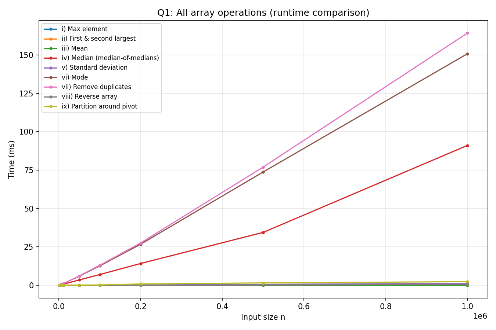
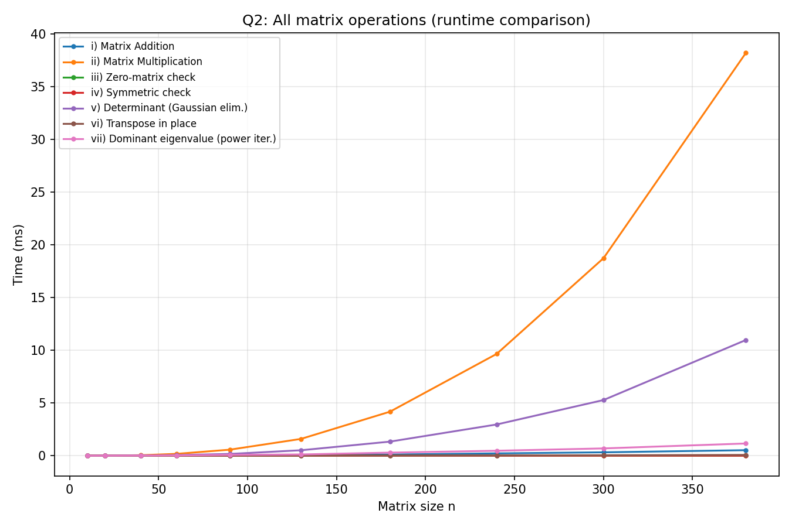
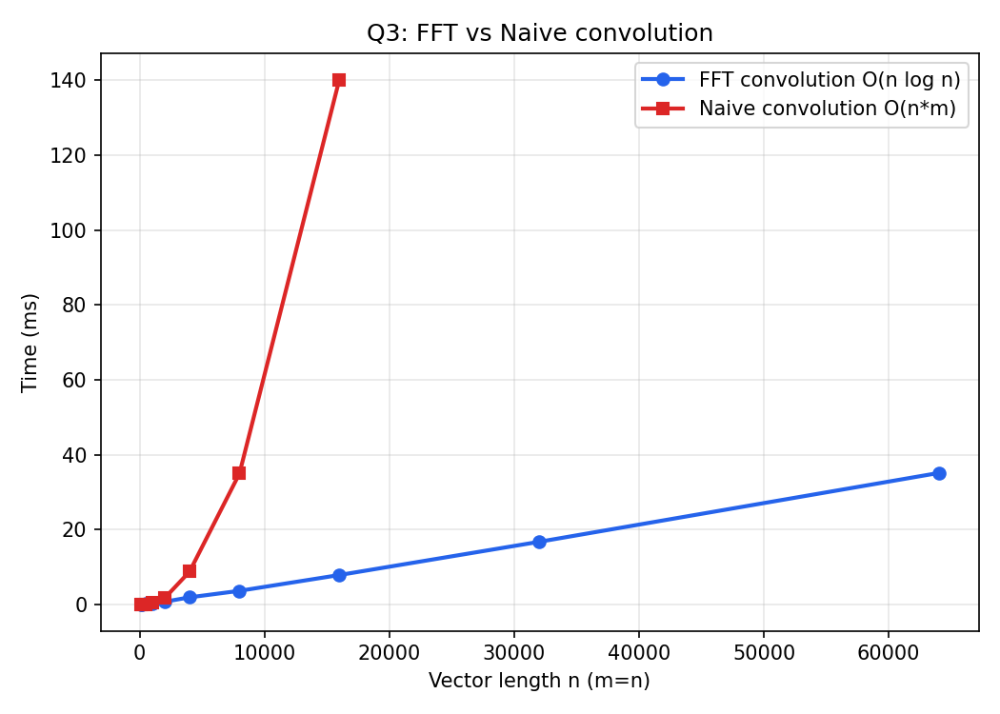
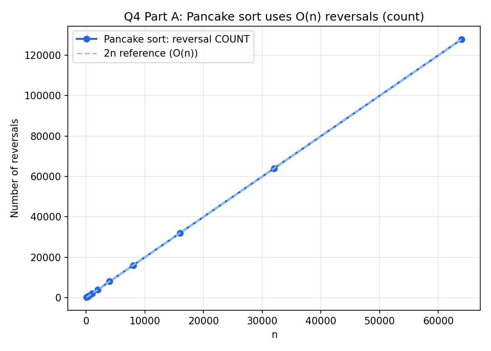
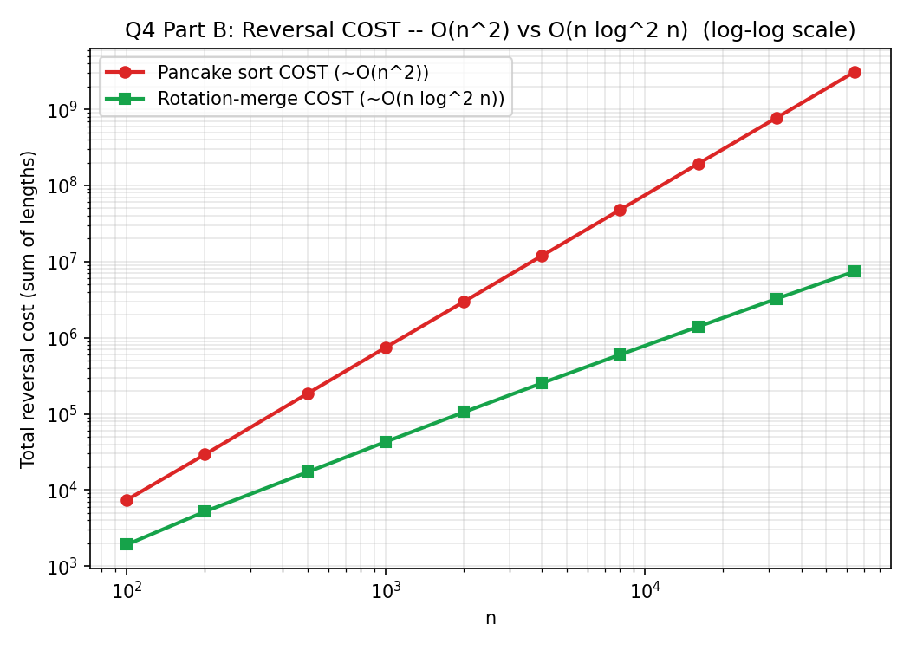

# Design and Analysis of Algorithms — Lab 06

C implementations and empirical timing studies of common 1D/2D data-structure operations, an FFT-based divide-and-conquer convolution, and two "sorting via reversal" procedures.

## Contents

| Question | Topic | Source | Results |
| --- | --- | --- | --- |
| 1 | 1D array operations and their complexities | [1D_array_operations_and_their_complexities.c](1.1D_array_operations_and_their_complexities/1D_array_operations_and_their_complexities.c) | [CSV](1.1D_array_operations_and_their_complexities/1D_array_operations_and_their_complexities.csv) · [plot](1.1D_array_operations_and_their_complexities/1D_array_operations_and_their_complexities_plot.png) |
| 2 | 2D square matrix operations and their complexities | [2D_square_matrix_operations_and_their_complexities.c](2.2D_square_matrix_operations_and_their_complexities/2D_square_matrix_operations_and_their_complexities.c) | [CSV](2.2D_square_matrix_operations_and_their_complexities/2D_square_matrix_operations_and_their_complexities.csv) · [plot](2.2D_square_matrix_operations_and_their_complexities/2D_square_matrix_operations_and_their_complexities_plot.png) |
| 3 | Convolution operation on vectors of size n | [Convolution_operation_on_vectors_of_size_n.c](3.Convolution_operation_on_vectors_of_size_n/Convolution_operation_on_vectors_of_size_n.c) | [CSV](3.Convolution_operation_on_vectors_of_size_n/Convolution_operation_on_vectors_of_size_n.csv) · [plot](3.Convolution_operation_on_vectors_of_size_n/Convolution_operation_on_vectors_of_size_n_plot.png) |
| 4 | Sorting via reversal procedure | [Sorting_via_reversal_procedure.c](4.Sorting_via_reversal_procedure/Sorting_via_reversal_procedure.c) | [CSV](4.Sorting_via_reversal_procedure/Sorting_via_reversal_procedure.csv) · [plot A](4.Sorting_via_reversal_procedure/Sorting_via_reversal_procedure_partA_plot.png) · [plot B](4.Sorting_via_reversal_procedure/Sorting_via_reversal_procedure_partB_plot.png) |

## Requirements and execution

A C compiler such as GCC or Clang, linked with the math library (`-lm`), is required. Run each program from its own directory so that its generated CSV is saved beside the source file. Each program offers three modes at runtime: (1) interactive input, (2) a built-in demo, and (3) a timing benchmark that writes the CSV used for the report plot.

```bash
# Question 1
cd 1.1D_array_operations_and_their_complexities
cc -std=c11 -Wall -Wextra -O2 1D_array_operations_and_their_complexities.c -o 1D_array_operations_and_their_complexities -lm
./1D_array_operations_and_their_complexities

# Question 2
cd ../2.2D_square_matrix_operations_and_their_complexities
cc -std=c11 -Wall -Wextra -O2 2D_square_matrix_operations_and_their_complexities.c -o 2D_square_matrix_operations_and_their_complexities -lm
./2D_square_matrix_operations_and_their_complexities

# Question 3
cd ../3.Convolution_operation_on_vectors_of_size_n
cc -std=c11 -Wall -Wextra -O2 Convolution_operation_on_vectors_of_size_n.c -o Convolution_operation_on_vectors_of_size_n -lm
./Convolution_operation_on_vectors_of_size_n

# Question 4
cd ../4.Sorting_via_reversal_procedure
cc -std=c11 -Wall -Wextra -O2 Sorting_via_reversal_procedure.c -o Sorting_via_reversal_procedure -lm
./Sorting_via_reversal_procedure
```

---

## 1. 1D array operations and their complexities

Nine common array queries are implemented and timed on the same random array of size \(n\):

1. **Maximum** — a single linear scan — \(\Theta(n)\).
2. **First and second largest** — a single linear scan, updating both running values — \(\Theta(n)\).
3. **Mean** — sum in one pass — \(\Theta(n)\).
4. **Median** — deterministic **median-of-medians** selection: elements are grouped into blocks of 5, the median of the block medians is found recursively and used as a pivot, and the array is partitioned around it — \(\Theta(n)\), even in the worst case.
5. **Standard deviation** — one pass for the mean, one pass for the variance — \(\Theta(n)\).
6. **Mode** — sort, then scan for the longest run of equal values — \(\Theta(n \log n)\).
7. **Remove duplicates** — sort, then scan and skip repeats — \(\Theta(n \log n)\).
8. **Reverse** — two-pointer in-place swap — \(\Theta(n)\).
9. **Partition around a pivot (`>= pivot` first)** — a single Lomuto-style pass — \(\Theta(n)\).

Unlike the randomized quickselect used for the median in Lab 05, median-of-medians guarantees

\[
T(n) = \Theta(n)
\]

for selection even in the worst case, at the cost of a larger constant factor; the two sort-based operations (mode, deduplication) remain \(\Theta(n \log n)\) since they rely on a full sort.



---

## 2. 2D square matrix operations and their complexities

Seven operations on \(n \times n\) matrices are implemented and timed:

1. **Addition** — element-wise sum — \(\Theta(n^2)\).
2. **Multiplication** — standard triple-loop product — \(\Theta(n^3)\).
3. **Zero-matrix check** — scan all entries — \(\Theta(n^2)\).
4. **Symmetry check** — compare each entry to its transpose position — \(\Theta(n^2)\).
5. **Determinant** — Gaussian elimination with partial pivoting — \(\Theta(n^3)\).
6. **Transpose** — in-place swap of off-diagonal entries — \(\Theta(n^2)\).
7. **Dominant eigenvalue/eigenvector** — power iteration, \(\Theta(n^2)\) per iteration.

The two cubic operations, multiplication and the determinant, are:

\[
T(n) = \Theta(n^3)
\]

and dominate the running time at large \(n\), while addition, the zero/symmetry checks, and transpose are all \(\Theta(n^2)\) — a single pass over the matrix's \(n^2\) entries — and power iteration adds another \(\Theta(n^2)\) factor per iteration for its matrix–vector product.



---

## 3. Convolution operation on vectors of size n

Two ways of convolving a length-\(m\) vector with a length-\(n\) vector are compared:

- **Naive convolution:** directly accumulates every product term into the output array, giving \(\Theta(mn)\).
- **FFT-based convolution (divide-and-conquer):** zero-pads both vectors to the next power of two, transforms each with the FFT, multiplies the transforms point-wise, and applies the inverse FFT to recover the result. Each FFT recursively splits the vector into even- and odd-indexed halves:

\[
T(N) = 2T(N/2) + \Theta(N) = \Theta(N \log N)
\]

so the whole convolution runs in \(\Theta(N \log N)\), where \(N\) is the padded length, versus \(\Theta(mn)\) for the naive method — a substantial win once \(m\) and \(n\) are large.



---

## 4. Sorting via reversal procedure

Two sorting methods are compared, both built entirely out of array-**reversal** operations, tracked by two metrics: the number of reversals performed, and their total cost (the sum of the lengths reversed):

- **Part A — Pancake sort (selection sort via reversal):** repeatedly finds the maximum of the unsorted prefix, reverses up to it to bring it to the front, then reverses the whole unsorted prefix to move it to its final position, giving
  \[
  \text{reversals} = \Theta(n), \qquad \text{total reversal cost} = \Theta(n^2)
  \]
- **Part B — Merge sort via rotation:** a merge sort whose merge step uses a sequence of three reversals to rotate one run's elements into place instead of using auxiliary buffer space, giving
  \[
  \text{reversals} = \Theta(n \log n), \qquad \text{total reversal cost} = O(n \log^2 n)
  \]

Pancake sort uses far fewer reversals but each one can be as long as \(n\), giving it quadratic total cost, whereas merge-sort-by-rotation uses more, smaller reversals for a better \(n \log^2 n\) total cost — trading reversal *count* for reversal *cost*.





## Results

The experimental plots and CSV files support the expected trends:

- Linear-time array queries (max, first/second largest, mean, std dev, reverse, partition) and the \(\Theta(n)\) median-of-medians selection all scale together, well below the \(\Theta(n \log n)\) sort-based operations (mode, deduplication).
- Matrix multiplication and determinant computation grow noticeably faster than the quadratic matrix operations as \(n\) increases, consistent with their \(\Theta(n^3)\) cost.
- FFT-based convolution scales near \(N \log N\) and pulls further ahead of naive \(\Theta(mn)\) convolution as vector length grows.
- Pancake sort needs \(\Theta(n)\) reversals but \(\Theta(n^2)\) total reversal cost, while merge-sort-by-rotation needs more reversals, \(\Theta(n \log n)\), but a smaller \(O(n \log^2 n)\) total cost — confirming the expected count-vs-cost trade-off between the two reversal-based sorts.
